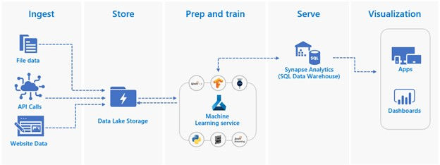

# Movies-Data-Consortium
  

The Movies dataset is extraordinarily rich in nature and a lot of interesting data science and exploratory data analytics analysis can be done using it. In this project I have created a movies data consortium by blending a file data store sourced from the Movies Dataset hosted in Kaggle, website data from Wikipedia and API data from themoviedb.org.

# INTRODUCTION 
 “EVERY TIME I GO TO A MOVIE, IT’S MAGIC, NO MATTER WHAT THE MOVIE’S ABOUT.”  
 Steven Spielberg   
Movie’s data analysis and applying machine learning models have been a very widely studied and funded subject by the production houses. Arguably Netflix made it mainstream when they announced, ‘Netflix Prize’ which was an open competition for the best collaborative filtering algorithm to predict user ratings for films, based on previous ratings without any other information about the users or films, i.e., without the users or the films being identified except by numbers assigned for the contest (Netflix_Prize) .  
This paper and a series of upcoming milestones will look at various aspects of movies data preparation, exploratory data analysis, merging multiple sources, visualizations, and predictive modelling.  

# FOCUS AREA
The Movies dataset is extraordinarily rich in nature and a lot of interesting data science and exploratory data analytics analysis can be done using it. For this project I plan to address the following topics:  
•	Raw data extraction for the file, API based and web datasets. Let us call this Bronze Layer.  
•	Data transformation using python from Raw to Processed stage. We will call this Silver Layer.  
•	Finally store the processed data using standard taxonomy in a SQL based serving layer. We will call this Gold Layer since this will be the single source of truth for the applications and the visualizations.   
•	In depth EDA across multiple facets of the Movies Dataset.  
•	Movies Dataset review sentiment Analysis Model Building.  
•	Lots of visualizations on the dataset showing various aspects of the data.  

# GUIDING PRINCIPLES
The work that will be subsequently done as part of this paper will have at the very least embody the following principles (ai/responsible-ai, n.d.):  
•	Fair - AI must maximize efficiencies without destroying dignity and guard against bias.  
•	Accountable - AI must have algorithmic accountability.  
•	Transparent - AI systems must be transparent and understandable.  
•	Ethical - AI must assist humanity and be designed for intelligent privacy.  

# Contents
| File/folder       | Description                                |
|-------------------|--------------------------------------------|
| `notebook`        | Python Notebooks.                          |
| `data`            | images for  casting manufacturing product.                        |
| `images`          | Sample images used for documentation.      |
| `.gitignore`      | Define what to ignore at commit time.      |
| `CHANGELOG.md`    | List of changes to the sample.             |
| `CONTRIBUTING.md` | Guidelines for contributing to the sample. |
| `README.md`       | This README file.                          |
| `LICENSE`         | The license for the sample.                |

# SOURCE DATASET  
### 1.	FILE DATA STORE  
The flat file data is sourced from the Movies Dataset hosted in Kaggle.   
URL: https://www.kaggle.com/rounakbanik/the-movies-dataset  
These files contain metadata for all 45,000 movies listed in the Full MovieLens Dataset. The dataset consists of movies released on or before July 2017. Data points include cast, crew, plot keywords, budget, revenue, posters, release dates, languages, production companies, countries, TMDB vote counts and vote averages.
This dataset also has files containing 26 million ratings from 270,000 users for all 45,000 movies. Ratings are on a scale of 1-5 and have been obtained from the official GroupLens website.
This dataset consists of the following files:
movies_metadata.csv: The main Movies Metadata file. Contains information on 45,000 movies featured in the Full MovieLens dataset. Features include posters, backdrops, budget, revenue, release dates, languages, production countries and companies.
keywords.csv: Contains the movie plot keywords for our MovieLens movies. Available in the form of a stringified JSON Object.
credits.csv: Consists of Cast and Crew Information for all our movies. Available in the form of a stringified JSON Object.
links.csv: The file that contains the TMDB and IMDB IDs of all the movies featured in the Full MovieLens dataset.
links_small.csv: Contains the TMDB and IMDB IDs of a small subset of 9,000 movies of the Full Dataset.
ratings_small.csv: The subset of 100,000 ratings from 700 users on 9,000 movies.

### 2.	WEBSITE DATA  
A.	List of ISO 639-1 codes for the languages from https://en.wikipedia.org/wiki/List_of_ISO_639-1_codes  
The reason for this data is to decode the language name stored in ISO 639-1 format.  
Note: I might get away with this website if the iso-639 library works correctly. https://pypi.org/project/iso-639/  
B.	List of official languages by country and territory from: https://en.wikipedia.org/wiki/List_of_official_languages_by_country_and_territory  
Planning to join this data and derive two additional fields ‘Country_Additional’ where the original movie language is a widely used and ‘Language_Dubbed_Potential’ which gives a list of languages which are spoken in addition to the language the movie is built in that specific country. My primary focus will be getting a list of potential languages where the movie ca be dubbed and potential countries where the movie can be released.  
C.	List of countries and dependencies by population from: https://en.wikipedia.org/wiki/List_of_countries_and_dependencies_by_population  
Planning to get the list of the countries with high population and expose a field called ‘Population_Additional’. This will give the producers an idea of the size of the market and whether it makes sense to release an original and/or a dubbed version of the movie in that country.  

### 3.	API DATA  
Fetch the expert review texts from https://developers.themoviedb.org/3/movies/get-movie-reviews  
Plan to join this with the movie dataset and do sentiment analysis on top of that.  

# ARCHITECTURE AND PROCESS FLOW  
Given below is the architecture that the project will use.  

Given Below is the step-by-step Process flow for the project.
## INGEST:   
For the Kaggle dataset the files will be downloaded in local and then uploaded to Data Lake Store. The reason is Kaggle does not allow any rest API calls to download its datasets.   
The API calls will be embedded inside a Python script and then data would be downloaded in the data lake in JSON format.  
The tables inside the wiki website will be scraped using specialized Python Libraries like Beautiful Soup and then stored in JSON or csv format.   
## STORE:  
A data lake is a storage repository that holds a large amount of data in its native, raw format. Data lake stores are optimized for scaling to terabytes and petabytes of data. The data typically comes from multiple heterogeneous sources, and may be structured, semi-structured, or unstructured. The idea with a data lake is to store everything in its original, untransformed state. This approach differs from a traditional data warehouse, which transforms and processes the data at the time of ingestion.  
Advantages of a data lake:  
•	Data is never thrown away because the data is stored in its raw format. This is especially useful in a big data environment, when you may not know in advance what insights are available from the data.  
•	Users can explore the data and create their own queries.  
•	May be faster than traditional ETL tools.  
•	More flexible than a data warehouse because it can store unstructured and semi-structured data.  
A complete data lake solution consists of both storage and processing. Data lake storage is designed for fault-tolerance, infinite scalability, and high-throughput ingestion of data with varying shapes and sizes. Data lake processing involves one or more processing engines built with these goals in mind and can operate on data stored in a data lake at scale. For this solution we are going to use Azure Data Lake Storage Gen2 (data-lake-storage-introduction) which is an object storage to enable Data Lake Storage patterns .  

## PREP AND TRAIN:  
For this project, we will use Python (in notebooks) as our primary programming language. We will run the Python codes in notebooks running in Azure Machine Learning. Azure Machine Learning (AML) is a cloud-based environment we can use to train, deploy, automate, manage, and track ML models (machine-learning). AML can be used for any kind of machine learning, from classical ml to deep learning, supervised, and unsupervised learning. This service is used to track and manage machine learning models, and then package and deploy these models to a scalable AKS environment.  

## SERVE:  
For the serving layer of our architecture, we want to support the following features:  
•	Combining diverse kinds of data sources into a sql platform.  
•	Transforming source data into a common taxonomy and structure, to make the data consistent and easily compared.  
•	Loading data using a highly parallelized approach that can support thousands of incentive programs, without the excessive costs of deploying and maintaining on-premises infrastructure.  
•	Greatly reducing the time needed to gather and transform data, so we can focus on analyzing the data.  
•	Establish a sql data warehouse to be a single source of truth for our data.  
•	Integrate relational data sources with other unstructured datasets.  
•	Use semantic modeling and powerful visualization tools for simpler data analysis.  
For this purpose, we are using Azure Synapse Analytics (synapse-analytics). Synapse Analytics is a distributed system for storing and analyzing large datasets. Its use of massive parallel processing (MPP) makes it suitable for running high-performance analytics. Azure Synapse can use PolyBase to rapidly load data from Data Lake storage.  

## VISUALIZATION:  
For the data visualization I am planning to use a variety of python libraries like matplotlib, seaborn, wordcloud etc. and if time permits, I might use the Power BI capabilities integrated with Azure Synapse analytics (quickstart-power-bi).  

# REFERENCES   
ai/responsible-ai. (n.d.). Retrieved from microsoft.com: https://www.microsoft.com/en-us/ai/responsible-ai  
data-lake-storage-introduction. (n.d.). Retrieved from https://docs.microsoft.com: https://docs.microsoft.com/en-us/azure/storage/blobs/data-lake-storage-introduction  
key-features-of-data-lake-storage-gen2. (n.d.). Retrieved from docs.microsoft.com: https://docs.microsoft.com/en-us/azure/storage/blobs/data-lake-storage-introduction#key-features-of-data-lake-storage-gen2  
kubernetes-service. (n.d.). Retrieved from azure.microsoft.com: https://azure.microsoft.com/en-us/services/kubernetes-service/  
latest. (n.d.). Retrieved from spark.apache.org: https://spark.apache.org/docs/latest/index.html  
machine-learning. (n.d.). Retrieved from azure.microsoft.com: https://azure.microsoft.com/en-us/services/machine-learning/  
Netflix_Prize. (n.d.). Retrieved from https://en.wikipedia.org: https://en.wikipedia.org/wiki/Netflix_Prize  
quickstart-power-bi. (n.d.). Retrieved from https://docs.microsoft.com: https://docs.microsoft.com/en-us/azure/synapse-analytics/quickstart-power-bi  
spark.apache.org. (n.d.). Retrieved from https://spark.apache.org/docs/latest/sql-programming-guide.html  
synapse-analytics. (n.d.). Retrieved from https://docs.microsoft.com: https://docs.microsoft.com/en-us/azure/synapse-analytics/overview-what-is  

